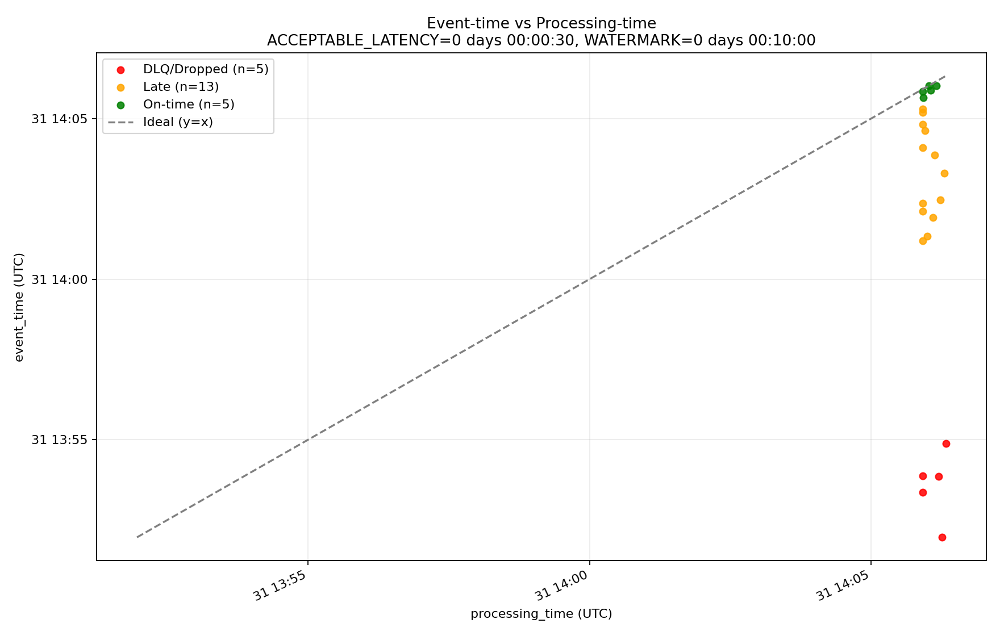

# Event-time vs Processing-time (Kafka)

Este exemplo mostra, de forma simples, como executar um **Producer** e um **Consumer** Kafka para visualizar a diferença entre **event-time** e **processing-time**.

---

## Como rodar

### 1. Subir o Kafka com Docker

Na pasta do desafio, execute:

```bash
docker compose up -d --build
```

Isso sobe o Kafka localmente, disponível em `localhost:9092`.

---

### 2. Criar o tópico

Com o Kafka rodando, crie o tópico usado no exemplo:

```bash
uv run python create_topicos.py
```

---

### 3. Rodar o Producer

Em um terminal, execute:

```bash
uv run python demo_producer.py
```

O Producer envia eventos continuamente para o Kafka.  
Cada evento contém um `event_time`, que pode estar no passado.

---

### 4. Rodar o Consumer

Em outro terminal, execute:

```bash
uv run python demo_consumer.py
```

O Consumer:
- lê as mensagens do Kafka
- registra o `processing_time`
- calcula a latência dos eventos
- gera o gráfico final

Ao final da execução, será criado o arquivo:

```
event_vs_processing_time.png
```

na pasta atual.

---

## Gráfico final

O gráfico gerado possui:

- **Eixo X**: processing-time  
- **Eixo Y**: event-time  
- **Linha tracejada (y = x)**: cenário ideal (processamento instantâneo)

### Interpretação

O gráfico evidencia que o **event-time não acompanha necessariamente o processing-time**.  
Eventos podem chegar atrasados, e o **watermark define até quando esses eventos ainda são considerados válidos**.

- Pontos próximos da diagonal → eventos on-time  
- Pontos acima da diagonal → eventos atrasados  
- Pontos muito acima da diagonal → eventos fora do watermark  

Esse comportamento é típico de sistemas de streaming em tempo real.