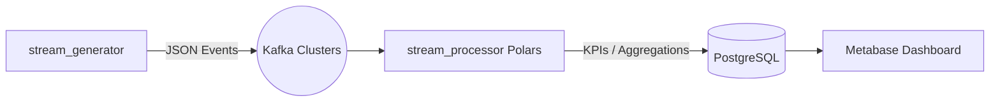

#  Simulação Black Friday — Pipeline de Dados & Dashboard

Este projeto apresenta uma solução de engenharia de dados de ponta a ponta, simulando o tráfego e as vendas de uma Black Friday em tempo real. O foco principal é a eficiência no processamento de streams e a integridade dos indicadores de negócio.

##  Arquitetura do Sistema

A solução utiliza uma arquitetura de streaming moderna, onde a regra de negócio é centralizada numa camada de processamento de alta performance.



### Componentes:
- **Ingestão:** Kafka (3 brokers) para garantir a resiliência das mensagens.
- **Processamento:** Python com **Polars** (Apache Arrow) para cálculos vetorizados e *lazy evaluation*.
- **Storage:** PostgreSQL para persistência dos KPIs calculados e eventos brutos.
- **Visualização:** Metabase para o dashboard analítico.

---

##  Decisões Técnicas e Diferenciais

### 1. Centralização da Regra de Negócio (Polars)
Ao contrário de arquiteturas que espalham a lógica entre SQL e ferramentas de BI, este projeto centraliza 100% das métricas (Margem, GMV, Rankings) no `stream_processor.py`. 
- **Vantagem:** Facilidade de manutenção e garantia de que o dado no dashboard é idêntico ao dado processado.

### 2. Estratégia de Idempotência e Consistência
Para evitar a duplicação de dados em caso de reinicialização do pipeline:
- **Raw Events:** Inserção com `ON CONFLICT DO NOTHING`.
- **KPIs:** Atualização via `UPSERT` (Do Update). A cada ciclo de processamento, o processador recalcula os totais a partir da fonte de verdade (tabela de eventos brutos), garantindo que o dashboard nunca exiba valores duplicados ou parciais.

### 3. Performance de Stream
O processador opera em micro-batches configuráveis via variáveis de ambiente:
- **Batch Size:** 400 eventos.
- **Flush Timeout:** 3 segundos.
Isso permite uma latência baixa (near real-time) para o dashboard, mantendo a eficiência computacional elevada.

---

## Persistência e Evidências (Pastas dashboard/ e docs/)
Devido às limitações nativas do Metabase (versão Open Source), que armazena os dashboards e as queries apenas na sua base de dados interna (sem opção de exportação nativa para código), estruturámos as pastas abaixo para garantir a auditabilidade total do fluxo:

### Camada de Dados (dashboard/)
- `schema.sql`: Contém o DDL completo do banco de dados, documentando a tipagem e os índices necessários.

- `metabase_queries.sql`: Extração manual do código SQL de cada card do Metabase. Isto garante que a lógica analítica esteja versionada e disponível para auditoria sem depender da interface da ferramenta.

### Camada de Visualização (docs/)
Como o dashboard é dinâmico e reside dentro do container, incluímos evidências visuais do resultado final:

- `dashboard_blackfriday.png`: Captura estática que valida a estrutura das 3 seções obrigatórias (C-Level, Vendas e Controladoria).

- `dashboard_flow.gif`: Demonstração do fluxo fim a fim. O GIF prova a reatividade do sistema, mostrando os indicadores a atualizar em tempo real conforme os eventos são gerados e processados pelo pipeline.
---

##  Estrutura do Dashboard (Metabase)

O dashboard foi construído para atender aos três pilares solicitados no desafio:

1.  **C-Level:** Visão macro com GMV Total, Lucro Líquido e Ticket Médio.
2.  **Vendas:** Performance granular por vendedor e loja, incluindo a métrica crítica de **Meta vs Realizado**.
3.  **Controladoria:** Análise de eficiência operacional, margens por categoria, custo total e taxas de devolução/cancelamento.

---

##  Como Executar

Todo o ambiente é orquestrado via **Docker**, garantindo a portabilidade da solução.

1.  **Iniciar a infraestrutura:**
    ```bash
    docker-compose up -d
    ```

2.  **Fluxo Automático de Inicialização:**
    - O container `bf-topic-init` cria os tópicos Kafka.
    - O `bf-seed-bootstrap` envia os dados históricos iniciais.
    - O `bf-generator` inicia a simulação de vendas em tempo real (25 eventos/segundo).
    - O `bf-processor` inicia o consumo, cálculo e persistência no Postgres.

3.  **Endereços de Acesso:**
    - **Dashboard:** [http://localhost:3000](http://localhost:3000) (Metabase)
    - **Banco de Dados:** `localhost:5432` (User/Pass: postgres)

---
